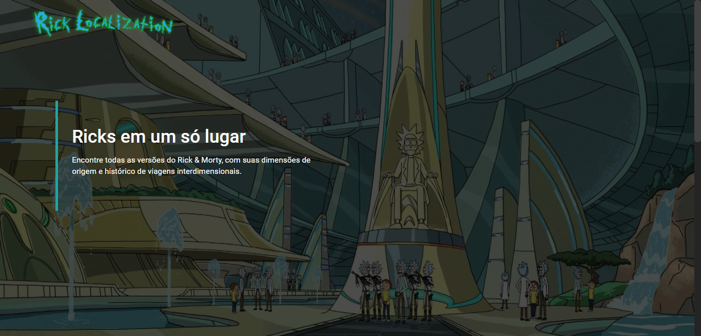

<div align="center" id="top"> 
  

  &#xa0;
</div>

<h1 align="center">
  
</h1>

<p align="center">
  

  

  
</p>

<p align="center">
  <a href="#dart-sobre">Sobre</a> &#xa0; | &#xa0;
  <a href="#rocket-tecnologias">Tecnologias</a> &#xa0; | &#xa0;
  <a href="#white_check_mark-requisitos">Requisitos</a> &#xa0; | &#xa0;
  <a href="#checkered_flag-iniciando">Iniciando</a> &#xa0;
</p>

<br>

## :dart: Sobre ##

É um sistema desenvolvido em Angular 9, com os cadastros e viagens de Ricks & Morty para supervisão da Cidadela dos Ricks. <br>
Para armazenas as informações foi usado o json-server como fake back-end.

## :rocket: Tecnologias ##

Foram utilizadas as seguintes ferramentas nesse projeto:

- [Angular 9](https://angular.io/)
- [Angular Material](https://material.angular.io/)
- [TypeScript](https://www.typescriptlang.org/)
- [JSON server](https://github.com/typicode/json-server)

## :white_check_mark: Requisitos ##

Antes de começar :checkered_flag:, você precisa ter o [Git](https://git-scm.com) e o [Angular cli](https://nodejs.org/en/) instalados.

## :checkered_flag: Iniciando ##

```bash
# Clone esse projeto
$ git clone https://github.com/alynevieira/ricklocalization

# Acesse
$ cd ricklocalization

# Instale todas as dependências
$ npm install

# Inicie o projeto
$ npm start

# Em outro terminal, inicie o servidor
$ npm run server

# O projeto irá abrir no <http://localhost:4200>
# e o servidor no <http://localhost:3000>
```

<div align="center">
Feito com :heart: por <a href="https://github.com/alynevieira" target="_blank">Alyne Vieira</a>
</div>
&#xa0;

<a href="#top">Ir para o topo</a>